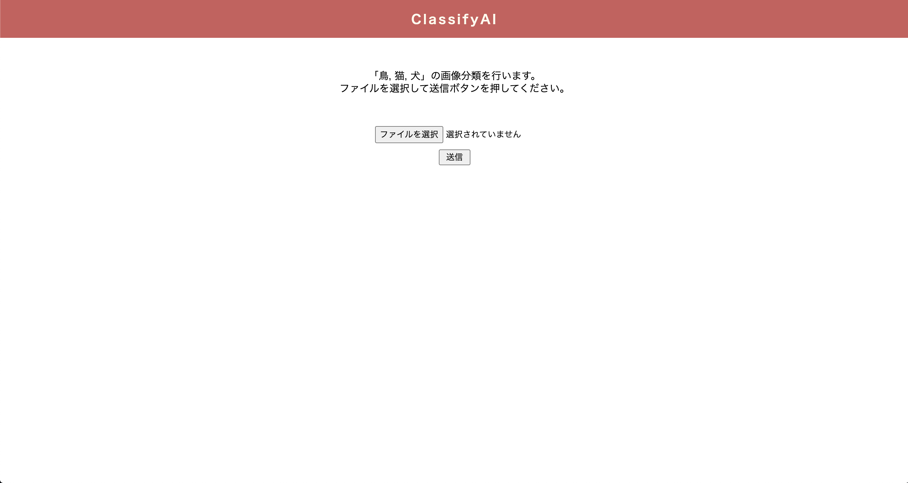
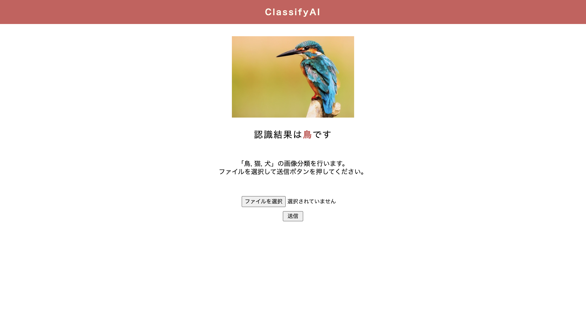

# 注意
pyenvはインストールされている前提. 
インストールされていない場合は, https://qiita.com/koooooo/items/b21d87ffe2b56d0c589b を参照.

# 環境構築手順
1. pyenvを用いてpythonをインストール. 3.7以上だと互換性云々で弾かれるので, 下記のバージョンでインストールすること.
```
$ pyenv install 3.6.5
```

2. 下記のコマンドを実行してインストールされたか確認.
```
$ pyenv versions
# *がついているバージョンが適用されている
  system
* 3.6.5 (set by /Users/sakura.yamamoto/Downloads/development/LT/flask_app/.python-version)
  3.7.1
  3.7.4

$ python -V
Python 3.6.5
```

3. もしも上記二つの確認コマンドでインストールしたバージョンが選択されていなかったら, 下記を実行. 再度手順2のコマンドで確認するとインストールしたpythonのバージョンが適用される.
```
$ pyenv local 3.6.5
$ pyenv global 3.6.5
```

4. 下記のコマンドを実行し, venvで仮想環境を作成する. 
```
$ python3 -m venv .venv
```

5. 下記のコマンドで仮想環境に入る. 入れると, 先頭に(.venv) が表示される. 
```
$ cd [project_name_dir]
$ . .venv/bin/activate
```

6. 再度手順2のコマンドを実行し, インストールされたバージョンが適用されているか確認. 適用されていない場合は下記のうちどちらかを行い, インストールしたpythonのバージョンに適用させる. 

- 方法１：pyenvでインストールしたバージョンを優先させるようにする.
```
$ export PATH="$HOME/.pyenv/shims:$PATH"
$ source ~/.bash_profile
```

- 方法２：[project_name_dir]以下にある.python-versionを削除し, 強制的にpyenvでインストールしたバージョンを優先させるようにする.
```
$ rm .python-version
```

7. 再度手順2のコマンドを実行し, 手順2のような出力になっていればOK.

# 注意
先ほど作成した.venvには入っている前提. 

# プログラム実行手順
1. 下記を実行し, 使用するパッケージをインストールする. 
```
$ pip install -r requirements.txt
```

2. 下記を実行し, flaskを立ち上げる準備をする. 
```
$ export FLASK_APP=predict.py
$ flask run
 * Serving Flask app 'predict.py' (lazy loading)
 * Environment: production
   WARNING: This is a development server. Do not use it in a production deployment.
   Use a production WSGI server instead.
 * Debug mode: off
 * Running on http://127.0.0.1:5000/ (Press CTRL+C to quit)
```

3. http://127.0.0.1:5000/ にアクセスし, 下記のような画面になっていればWebアプリ化成功！



# Webアプリ化を試す
1. 下記の画面の中にある「ファイルを選択」をクリックし, 「鳥」「猫」「犬」のいずれかの画像をアップロードする. 
 

1. 下記のような画面が表示されたらOK. 

